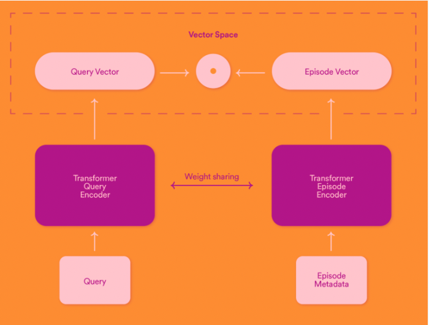

- [Introducing Natural Language Search for Podcast Episodes, 2022](https://engineering.atspotify.com/2022/03/introducing-natural-language-search-for-podcast-episodes/)

## 배경: term-based search
- podcast 검색시, 단어별로 podcast metadata에 match가 되면 검색이 되는 형태입니다.
  - normalization, aliases 등 일반적인 검색 성능 향상 기법을 추가로 사용
- 하지만 유저들이 natural language 스럽게 검색을 하면 경우는 잘 찾지 못하는 경향이 있습니다.

## 해결책: Natural Language Search (Semantic Search)
- Natural Language Search 는 exact work match가 아니라 semantically 연관이 되어 있는 것을 찾아줍니다.
- 이를 podcast episode retrieval에 사용했습니다.
- Deep Learning NLP 방법론(self-supervised learning, Transformer)을 사용했고 ANN으로 vector search를 진행했습니다.
- 먼저, query와 podcast의 vector들이 같은 embedding space에 있도록 훈련하고 query가 들어오면 가까운 podcast를 찾도록 했습니다.

### pre-trained Transformer model 사용
- vanilla BERT는 단어 embedding에 장점이 있기에, 문장 표현이 더 좋은 SBERT를 사용했습니다.
- 그런데 multilingual 모델이 필요해서 실험 끝에 Universal Sentence Encoder CMLM model 을 base model로 선택했습니다.
  - [Universal Sentence Representation Learning with Conditional Masked Language Model, 2021](https://arxiv.org/pdf/2012.14388.pdf)

### Preparing the data
- search log를 이용하여 (query, episode) pair를 만들었습니다.
- 추가로 한번에 원하는 결과를 얻지 못하고 유저가 다시 검색을 했던 log를 이용하여 (query_prior_to_successful_reformulation, episode) pair를 만들었습니다. 이를 통해 좀 더 semantic한 pair를 만들 수 있었습니다.
- 아래 논문에서 아이디어를 얻어 synthetic query를 만들기도 했습니다.
  - [Embedding-based Zero-shot Retrieval through Query Generation](https://arxiv.org/pdf/2009.10270.pdf)
  - BART를 이용하여 (synthetic_query, episode) pair를 생성
- 마지막으로 일부 유명한 episode를 이용하여 semantic query들을 직접 만들기도 했습니다.
  - 이는 eval set에서만 사용
- 아래 논문들을 참고하여 negative pair를 구성하였습니다. 방법은 in-batch negative sampling입니다.
  - [Que2Search: Fast and Accurate Query and Document Understanding for Search at Facebook](https://research.facebook.com/publications/que2search-fast-and-accurate-query-and-document-understanding-for-search-at-facebook/)
  - [Dense Passage Retrieval for Open-Domain Question Answering](https://arxiv.org/pdf/2004.04906.pdf)
- negative pair를 mini-batch sample안에서 만드는 방법입니다. 즉, batch size가 $B$이면 $B(B-1)$개의 negative pair가 만들어집니다.

### Training
- 모델의 형태는 아래 그림과 같습니다. Two-Tower 형태입니다.

- 최종 연산에서는 computational efficiency를 위해 아래와 같이 matrix를 만듭니다.
  - query, episode의 vector의 cosine similarity matrix
- label은 identity matrix입니다. 대각선은 positive(1), 나머지는 negative(0)인 matrix입니다.

$$
\begin{matrix}
sim(q_1, e_1) & sim(q_1, e_2) & ... & sim(q_1, e_B)\\
sim(q_2, e_1) & sim(q_2, e_2) & ... & sim(q_2, e_B)\\
... & ... & ... & ...\\
sim(q_B, e_1) & sim(q_B, e_2) & ... & sim(q_B, e_B)\\
\end{matrix}
$$

- MSE loss를 사용했으며 마지막 [in-batch hard negative mining](https://www.tensorflow.org/recommenders/api_docs/python/tfrs/layers/loss/HardNegativeMining)와 [margin loss](https://gombru.github.io/2019/04/03/ranking_loss/)를 사용했습니다.

### Offline evalutaion
- 모델 평가시 2가지 metric를 이용했습니다.
- In-batch metrics
  - in-batch negatives를 이용해서 batch 단위로 Recall@1과 MRR(Mean Reciprocal Rank)를 사용
- Full-retrieval setting metrics
  - batch 단위가 아니라 전체 단위
  - 훈련중에 주기적으로 eval set을 이용하여 Recall@30, MRR@30을 계산

## Production

### Offline indexing of episode vectors
- episode vector들은 offline에서 미리 계산되어지고 Vespa search engine에 indexed됩니다.
- ANN을 이용하여 vector를 찾고 Vespa의 기능을 이용하여 episode 인기도를 고려한 re-rank도 진행합니다.

### Online query encoding and retrieval
- 유저가 검색하면 GPU inference로 query vector를 구하고 Vespa를 이용하여 top30개의 episode를 가져옵니다.
- vector cache도 이용합니다.

### There is no silver bullet in retrieval
- 항상 Natural Language Search가 좋은 결과만 내는 것은 아니기 때문에 다른 방법들도 함께 사용합니다.
  - 기존에 사용하던 Elasticsearch를 이용한 방법 등등
- 다양한 source로 retrival하고 final-stage reranking model을 이용하여 서빙합니다.