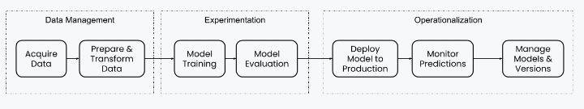

- [The Rise (and Lessons Learned) of ML Models to Personalize Content on Home (Part I)](https://engineering.atspotify.com/2021/11/the-rise-and-lessons-learned-of-ml-models-to-personalize-content-on-home-part-i/)
- [The Rise (and Lessons Learned) of ML Models to Personalize Content on Home (Part II)](https://engineering.atspotify.com/2021/11/the-rise-and-lessons-learned-of-ml-models-to-personalize-content-on-home-part-ii/)

## 배경
- 여러가지 모델이 있지만 3가지 모델에 대해 이야기할 예정입니다.
  - Podcast model: 유저가 좋아할 것 같은 podcast 예측
  - Shortcuts model: 메인화면 중 shotcut부분에서 유저가 들을 것 같은 음악 예측
  - Playlist model: 새로운 유저가 좋아할 것 같은 노래 예측

## simplicity and automation
- ML workflow는 3가지로 구분합니다.
  - data management, experimentation, operationalization

- 아래 그럼처럼 다향한 부분에서 자동화를 시키고 pipeline을 잘 구성했습니다.

## training, serving data 일원화
- training과 serving시 데이터를 처리하는 과정이 달라서 4개월동안 잘못된 결과를 사용했습니다.
  - training은 batch, serving은 real time
- 이에 대한 해결책으로 serving 인프라를 이용하여 이미 transformed된 데이터를 잘 저장해서 추후 training에 사용했습니다.
  - 동일한 feature를 훈련과 serving에 사용가능
- 추가로 TFDV(tensorflow data validation)을 이용하여 training data와 serving data를 비교검증했습니다.
  - 스키마, 분포 등등

## experimentation
- 실험 플랫폼
  - 모델 실험은 처음에는 정해진 platform을 사용하다가 Spotify만의 ML infra를 이용했습니다.
- 모델 비교 평가
  - 모델 평가시 처음에는 간단한 baseline model을 만들어서 비교했습니다.
  - 하지만 항상 AB test를 할 수 있는 상황이 아니므로 이에 대한 proxy offline metrics가 필요합니다.
  - offline evaluation을 잘하는 방법에 대해 많은 고민을 하고 pipeline도 따로 만들어서 평가하고 있습니다.
  - 추천 모델 평가시 주로 NDCG@k를 사용했습니다.
- 단순한 수치를 넘어선 평가
  - metric의 수치만으로 추천모델을 평가하기는 어렵습니다.
  - 대시보드로 데모페이지를 만들어서 사용했습니다. 특정 feature를 특정 model에 넣으면 어떤 결과가 나오는지 확인합니다.
  - 대시보드를 통해 직접 검증하여 모델비교, 절대평가, 검증, 디버깅, 버그픽스 등을 할 수 있기에 아주 중요한 과정입니다.

### model retraining과 deployment 자동화
- 처음에는 offline prediction을 했고 추후에 online prediction으로 방법을 바꿨습니다.
- 새롭게 훈련된 모델을 deploy할 때, 처음에는 수동적으로 하는 부분이 많았습니다. 하지만 차차 이를 자동화했습니다.
  - retrain을 자동화하고 bad 모델이 deploy되는 것을 막기 위해 evalutaion score threshold를 넘는 경우만 deploy되도록 구성