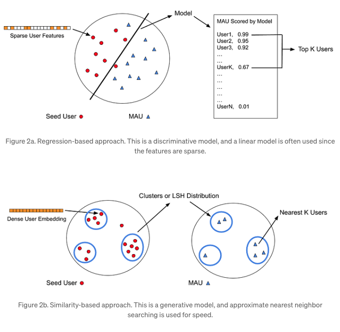
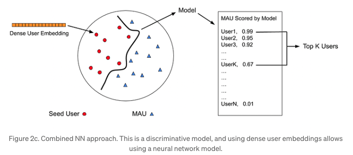

- [The machine learning behind delivering relevant ads](https://medium.com/pinterest-engineering/the-machine-learning-behind-delivering-relevant-ads-8987fc5ba1c0)

## 배경
- pinner에게 적절한 광고를 전달하는것이 목적입니다.
- 사용하고자 하는 접근법은 Lookalike 방법입니다. 즉, 특정 광고에 관심이 있는 유저들과 비슷한 유저들에게 광고를 하는 방법입니다.

## 방법론: user embedding + MLP classifiers
- LookAlike 방법은 크게 2가지로 구부합니다.
  - regression-based
  - similarity-based
- 먼저 regresion-based는 seed user를 포함하여 0,1(광고 클릭 여부) binary classification 모델을 훈련하고 infernce dataset user들을 예측한 뒤 top-k score인 유저들을 뽑아 비슷한 유저들을 뽑습니다.
- 이에 반해 similarity-based는 seed user의 embedding값을 만들고 nearest neighbor를 찾아서 비슷한 유저들을 뽑습니다.

- 각 방법은 장단점이 있습니다.
  - regression-based
    - supervised learning 기반이기에 seed와 label의 구조, 정보를 잘 담고 있습니다. (low bias, high variance)
    - seed list의 크기가 클 때 효과적입니다.
    - 훈련과 추론 리소스가 많이 듭니다.
  - similarity-based
    - user representation learning 기반이기에 data sparsity에 대한 강점이 있습니다. (high bias, low variance)
    - seed list의 크기가 작을 때 효과적입니다.
    - 목적에 부합하는 user similarity를 정의하기 어려울 수 있습니다.
- pinterest에서는 두가지 모두 사용했습니다. 먼저 pretrained된 user embedding을 만들고 이를 classifier에서 사용했습니다.

## 모델 아키텍처
- (pretrained universial) user embedding을 만들어서 각 advertiser model에서 이용합니다.
  - user embedding을 만드는 내용은 해당 [논문](https://www.pinterestcareers.com/media/gvnpojec/transferlearning-kdd2019.pdf)에 나와있습니다.
- seed user를 positive로 그외 user에서 negative를 뽑아서 사용합니다.
- 이때 단순한 binary classification이 아니라 각 sample마다 다양한 weight를 이용합니다. 즉, log loss에 weight가 들어간 형태입니다.
  - weight는 number of impression, CTR 등등이 됩니다.
  - scaling해서 weight들의 scale은 동일하게 만들어서 사용합니다.

## 평가

### offline
- seed list들을 9:1로 나누고 9는 모델 훈련에 사용하고 1을 포함한 나머지에 대해 prediction을 진행합니다. 그렇다면 1은 상위에 rank되어야 할 것입니다. 이를 이용해서 metric을 구합니다.
  - metric: recall@k, precision@k

### online
- 2주동안 2개의 모델로 AB test를 진행했습니다.