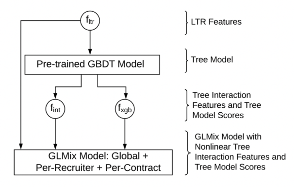
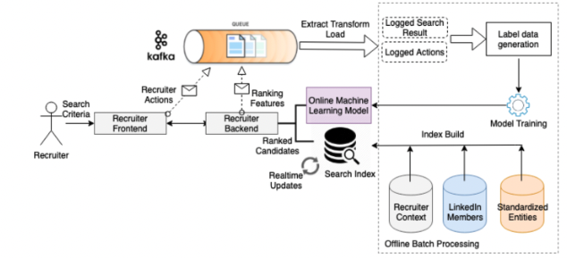

- [The AI Behind LinkedIn Recruiter search and recommendation systems, 2019](https://engineering.linkedin.com/blog/2019/04/ai-behind-linkedin-recruiter-search-and-recommendation-systems)

## Background
- LinkedIn Recruiter라는 product로 리크루터와 매니저들이 talent pools에서 원하는 후보자들을 확인 할 수 있습니다.
- 이때 리크루터의 query에 알맞는 후보자들을만 보여주는게 아니라 후보자들도 관심이 있는 query(job offer)이여야 합니다.
  - 이게 관해 inMail Accept라는 metric을 고려합니다.
  - 리크루터의 offer에 대해 후보자들이 긍정적인 답변을 보내는 정도를 측정합니다.
  - top k 후보자들중에서 mail을 받고 답변을 보내는 비율입니다. (precision@k)
- 리쿠르터의 search에서 query formulation도 도와줍니다.
- talent search system에서 리크루터를 위한 개인화도 중요합니다.

## Method
### Non-linear modeling with GBDT
- LinkedIn Recruiter search ranking에서 GBDT를 사용합니다.

### Context-aware ranking with pairwise learning-to-rank
- GBDT의 성능 향상을 위해 search context를 추가했습니다.
  - searcher context: personalization feature
  - query context: query-candidate matching feature
- 또한, pairwise ranking objective를 사용하여 같은 context에서 후보자들끼리 비교하여 모델링을 진행했습니다.

### Deep and representation learning efforts
- GBDT는 아주 좋은 성능을 보여주지만 한계점도 있습니다.
  - discete feature의 embedding을 사용하기 위해서는 따로 embedding 값을 만들어줘야합니다.
  - sparse id feature의 경우도 트리모델이 약합니다.
  - 딥러닝모델에 비해 유연성이 떨어집니다. (objective function의 다양성, 모델의 구조 변동 등)
- 따라서 이를 위해 딥러닝 모델을 연구하고 있습니다.
- talent search moeling에서 query의 결과가 매우 작은 경우를 보완하기 위해 graph 알고리즘을 이용합니다.
- 이를 이용해서 embedding을 만들어 모델에 적용해보니 ranking에서는 별차이 없었지만 similarity를 이용하여 일부 query의 결과를 더 풍부하게 만들어줍니다.
  
### Entity-level personalization with GLMix
- recruiter search domain에서는 다양한 entity들(리크루터, 후보자, 회사 등등)을 모델에서 고려하기 위해 하이브리드 모델인 GLMix를 아래 그림과 같이 사용합니다. (recruiter-level, contract-level personalization)
  - LTR features: learning to rank features
  - GBDT가 feature (interaction) transformer로도 사용되고 결과 score도 사용됩니다.

### In-session online personalization
- 오프라인으로 훈련된 모델을 사용할때 단점은 해당 session에서의 유저 피드백을 적용할 수 없다는 것입니다.
- 이를 위해서 아래 그림과 같이 먼저 후보자들을 그룹으로 나누고 muili-armed bandit 모델로 리크루터의 현재 context에 기반하여 가장 적절한 그룹을 고르고 피드백에 따라서 각 그룹의 후보자들을 rank합니다.
- 계속해서 online machine learning에 대해 연구하고 있습니다.

## System Design and Architecture
