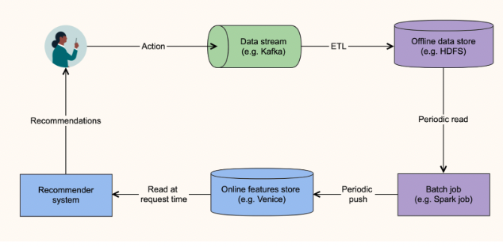
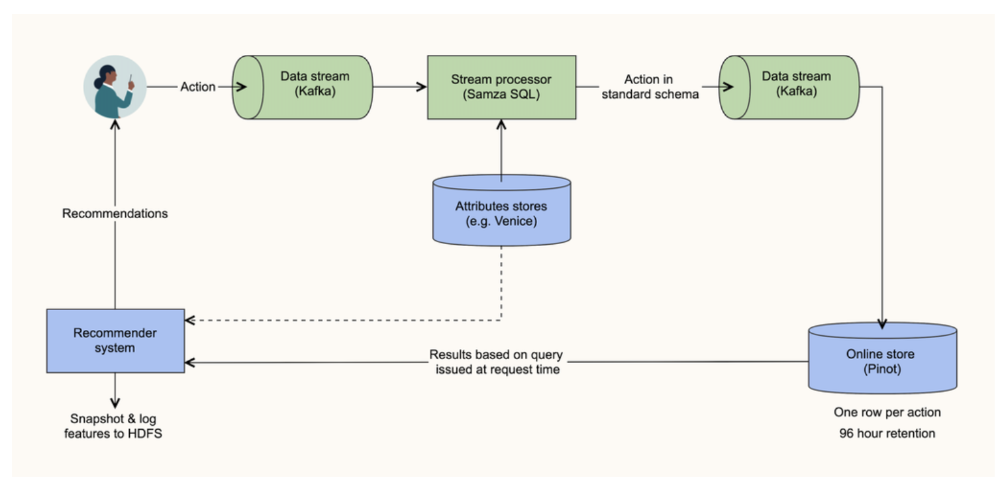

- [Near real-time features for near real-time personalization, 2022](https://engineering.linkedin.com/blog/2022/near-real-time-features-for-near-real-time-personalization)

## Background
- LinkedIn에서는 유저의 액션을 통해서 좋은 추천을 하려고 합니다.
- 예를 들어, 유저가 서울에 있는 웹 개발자에 지원했다면 유저는 직업을 구하고 있고 특히 웹 개발자에 관심이 있음을 알 수 있습니다.
- 하지만 이런 액션에 기반하여 추천결과가 만들어지기 까지는 시간차가 존재합니다.
- 아래 그림처럼 배치성으로 추천결과 또는 input feature를 만들기 때문입니다.



- offline data로의 ETL의 속도, 배치 job의 빈도에 따라 time delay는 천차만별입니다.
- 실험을 통해서 확인해본 결과 추천 모델의 delay가 길어질수록 metric이 떨어졌습니다.
- 이를 해결하기 위해 2가지 아이디어를 생각했습니다.
  - 모든 액션데이터가 아닌 최근 며칠 데이터를 online store에 보관합니다.
  - 미리 계산하지 않고 작은 양의 데이터로 on-demand로 계산합니다.

## Computation of features based on a member’s past actions
- LinkedIn 내부 대부분은 feature를 계산할 때 다음과 같은 패턴을 보입니다.
  - 특정 시간동안 유저의 액션을 구합니다.
    - 예를 들어, 한 유저의 7일간 job apply action 데이터를 구합니다.
  - 액션을 취했을 때 파악할 수 있는 특징을 구합니다.
    - 7일간 지원한 job들의 embedding을 구합니다.
  - 특징들에 대한 summarization을 진행합니다.
    - embedding들의 average를 구합니다.

## Summary of requirements
- 위의 과정을 진행하기 위해 필요한 것들이 있습니다.
  - 관심있는 유저 액션을 몇 초안에 저장해야합니다.
  - 액션과 관련이 있는 entity들의 특징을 찾을 수 있어야 합니다.
  - 유저 액션와 관련한 feature를 100m안에 계산 할 수 있어야 합니다. (그래야 실시간 추천에서 이용할 수 있습니다.)

## Representing actions in a standard schema
- 먼저 standard schema를 정합니다. (유저 액션에 대한 정보)
- 예를 들면, 아래와 같습니다.
```
{ 
  "actor": 111,
  "actorAttributes": {"industry": "internet"},
  "verb": "job-apply", 
  "verbAttributes": {"device": "mobile"},
  "object": "job:222",
  "objectAttributes": {"geo": "new york", "embedding": [0.1, 0.4, 0.9]}, 
  "timestamp": 345678
}
```

## Design of solution
- 아래 그림의 stream processor에서 데이터를 전처리하여 standard schema의 형태로 output을 만듭니다.
- 그리고 이 output은 kafka를 통해 Pinot에 저장되고 이는 96시간 후 삭제됩니다.
  - Apache Pinot
    - actor 를 primary key 로 사용
    - Kafka로 부터 오는 데이터를 준실시간으로 받을 수 있음
    - analytical queries에 대해 빠르게 연산가능 (100ms 이하)
    - horizontally scalable 하기에  여러 개의 recommender systems 에서 query 할 수 있습니다.
    - 과거 오래된 데이터를 삭제하는 기능 존재



- 유저id 111인 방문하여 추천시스템쪽에서 유저의 최근 24시간 정보를 구하고 싶은 경우 아래처럼 쿼리를 통해 데이터를 가져옵니다.

```sql
SELECT objectAttributes FROM store 
WHERE actor = 111 AND verb = ‘job-apply’ AND timestamp > (currentTime - 24 hours)
```

- 항상 모든 데이터를 Pinot에서 가져오는 것은 아니고 다른 저장소를 이용하기도 합니다. (ex. 크기가 큰 embedding)

## Results
- 유저 액션이 아주 빠른시간에 저장되고 추천시스템에서 이를 사용하게 되므로 몇 초 후에 바로 쌓인 데이터를 통해 결과가 달라집니다.
- 각종 성능, 비즈니스 metric이 상승했습니다.
