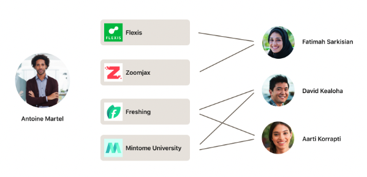
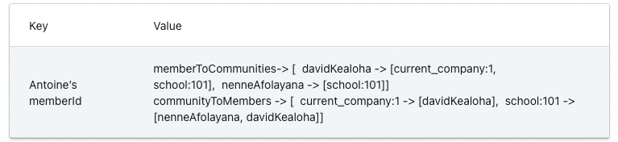
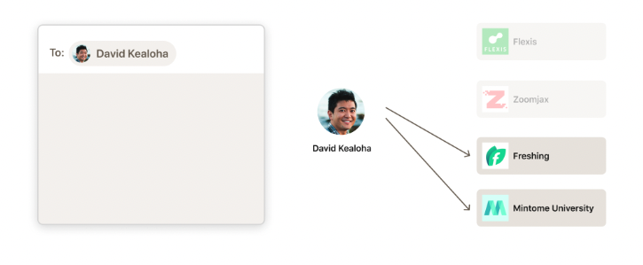
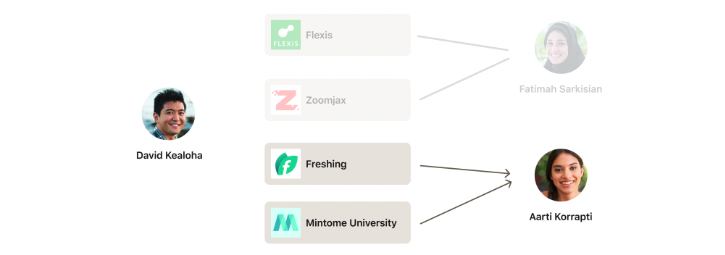
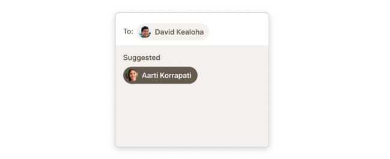
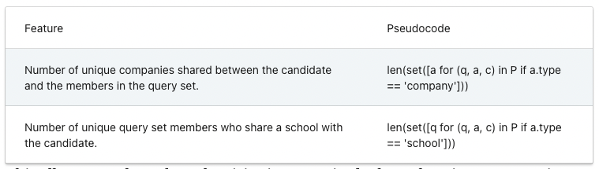

- [Community building recommender for group chats in LinkedIn Messaging, 2022](https://engineering.linkedin.com/blog/2022/community-building-recommender-for-group-chats-in-linkedin-messa)

## Background
- LinkeIn 에서는 당연히 relationship 이 중요합니다.
- 그중 LinkeIn Messaging 은 유저들간의 대화를 할 수 있게 하는 중요한 기능입니다.
- 하지만 대화를 나누기 위한 커뮤니티를 만드는 것은 쉽지 않고 group chat 멤버 구성을 돕기 위해 relevant connection 추천(group chat에 new member 추천)을 하려고 합니다.

## Solution

### Member-to-member affinity
- pairwise member-to-member affinity score 를 통해 각 member들이 서로 얼마나 연관이 있는지 알 수 있습니다. ([Personalizing LinkedIn Feed](https://dl.acm.org/doi/10.1145/2783258.2788614))
- 하지만 group chat의 관점에서는 member-to-member 정보만으로 group으로 묶이기에는 다소 한정적인 정보입니다. 일대일로는 아주 가까워도 막상 그룹으로 묶일만한 집단이 없을 수도 있습니다.
- 이러한 이유로 새 memeber 추천에 있어서 기존 group chat 을 query set 으로 생각하여 접근하는게 효과가 좋을 것 입니다.

### Shared connections
- builder 와 query set 간의 common connections 을 고려할 수 있을 것 입니다.
- 하지만 여기서의 문제도 있습니다. connection 이 항상 group chat과 directly related 된 것은 아닙니다.
- 예를 들어, 전혀 connection이 없지만 builder 가 중간에서 group을 만들수도 있을겁니다.

## Our solution
- 먼저, group chat 들은 주로 shared community 들의 member 들로 만들어 진다고 생각했습니다.
- 그래서 각 node 가 member, community 인 bipartite graph 를 만들었습니다.

### Data structure
- 목표는 member's network 에 있는 community 들을 예측해서 추천하는 것입니다.
- 먼저 professional identity (직장, 학교, LinkedIn Group) 을 이용했습니다. 이를 통해서 아래와 같은 data structure 를 구성했습니다.

### Storage
- 위 형태의 personalized bipartite graph 는 Venice 라고 하는 LinkedIn 의 key-value 분산시스템에 저장합니다.
- 최근 30일 동안 LinkedIn 에서 활동이 있었던 member 들을 매일 저장합니다.

### Graph exploration algorithm
- 먼저, memeber 의 graph 를 가져옵니다.
- personalized graph 를 bfs 로 2 step 진행합니다. 이 때 연결된 모든 community node 로 진행합니다.
- 에를 들어 보겠습니다.
  - Antoine 는 David 를 query set 에 추가합니다.
  - Antoine 과 David 가 share 하는 모든 community node 들에 연결된 memeber 들을 찾습니다.
  - 이를 query set 의 각 connection 마다 진행하고 방문횟수에 기반하여 rank 하고 추천합니다.

### Results from launch
- baseline 에 비해 40% CTR 상승하였습니다.
- 1.5% dinstinct member 수 상승, 5.2% group chat 수 상승이 있었습니다.

### Leveraging machine learning
- 단순 방문횟수보다 ML을 이용하여 각 community category 마다 다른 weight 를 주려는 접근을 하려고 했습니다.
- training observation 은 유저가 0.5초 이상 본 것으로 만들고 클릭을 postive label 로 하였습니다.
- 그래서 candidate 들을 클릭할 확률을 logistic regression 예측하는 것입니다.
- feature 들은 아래와 그림과 같고 feature 의 weight 가 가중치가 됩니다.

## Result
- ML 모델을 통해서 CTR이 17% 상승했고 uniqeu member 수도 5% 상승했으며 새로운 group chat 도 2.7% 더 만들어졌습니다.