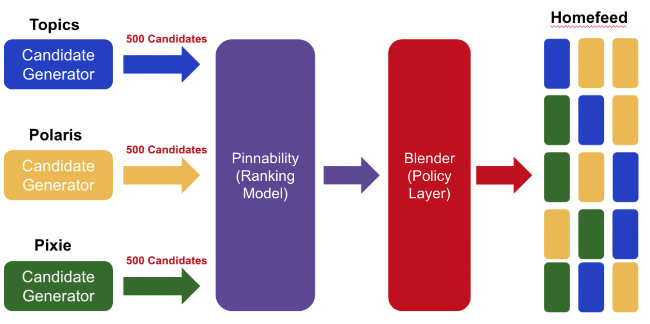

- [Pinterest Home Feed Unified Lightweight Scoring: A Two-tower Approach, 2021](https://medium.com/pinterest-engineering/pinterest-home-feed-unified-lightweight-scoring-a-two-tower-approach-b3143ac70b55)

## 베경
- 수백만개의 컨텐츠를 홉피드에서 개인화 추천해줍니다.
- 해당 글에서는 light-weight scoring layer를 이용하여 홈피드 추천하는 과정을 다룹니다.
- 홈피드에서 다양하고 의미있는 컨텐츠를 추천하기 위해 다양한 소스를 사용했습니다.
  - pixie, 임베딩기반 소스 등
- 그런데 이런 다양한 소스들은 각자의 data pipeline이 있고 각기 다른 light-weight model들이 있습니다.
- 이에 따라 엔지니어링 리소스와 개발 속도도 느려지고 실시간 서빙에도 영향을 주게 되었습니다.
- 따라서, 통일된 형태의 ML모델과 candidate generator 서빙방법이 필요했습니다.

## Two-Tower Architecture
- 일반적인 two-tower 모델의 형태를 이용합니다.

### training
- in-batch negative sampling 방법을 사용했습니다.
- batch size는 6000으로 하여 positive들이 충분히 많은 negative들과 함께 학습되도록 했습니다.

### serving
- Pin embedding serving
  - user들이 사용하는 pin에 대해서 long-tail rule을 따르고 pin의 content가 많이 바뀌지 않습니다.
  - 따라서 online request마다 embedding을 계산하지 않고 offline에서 미리 계산된 pin embedding을 사용합니다.
  - 생긴지 얼마 안된 pin은 online inference를 진행합니다.
- User embedding serving
  - user들은 관심 pin이 자주 바뀔 수 있기 때문에 user request마다 online inference를 합니다.

### Evaluate
- Engagement
  - two-tower model이 online 실험에서 save 수치를 올리고 drop 수치를 낮췄습니다.
  - two-tower model의 장점인 pin, user와 관련한 다양한 feature를 통해 embedding을 만들 수 있어서 그런 것 같습니다.
- Diversity
  - 모든 candidate generator에 동일한 model을 사용하는 것에 걱정을 했습지만 오히려 diversity는 향상되었습니다.
  - 좋은 embedding이 user의 다양한 관심사 정보를 담고 있고 좋은 추천 결과에 따라 user들이 더 활발하게 서비스를 사용해서 그런 것 같습니다.

### Infra cost
- dot product라는 연산은 online inference라고 하더라도 cost가 크지 않습니다.
- 또한, two-tower model 하나로 통일된 방법론을 사용하는 것도 큰 이점입니다.