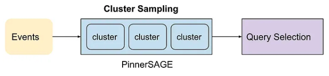
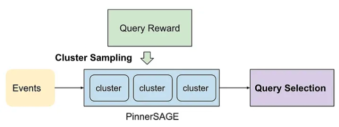
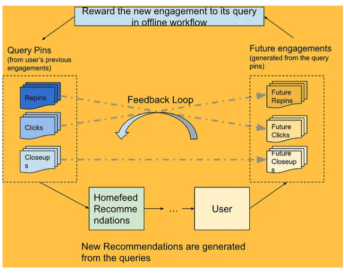

- [Query Rewards: Building a Recommendation Feedback Loop During Query Selection, 2022](https://medium.com/pinterest-engineering/query-rewards-building-a-recommendation-feedback-loop-during-query-selection-70b4d20e5ea0)

## 배경
- Homefeed에서 추천되는 pin들의 30%는 pin to pin-based retrieval에서 만들어집니다.
- 이는 query pin들이 주어지면 이에 해당하는 pin들이 추천되는 것입니다.
- 이때 추천은 이전에 user들의 데이터에 기반하여 retrieval pool을 만듭니다.
- 그렇다면 user profile을 통해서 적절한 query pin을 어떻게 만들 것인지가 중요해집니다.

## Query Reward 추가 전 Homefeed Query Composition
- PinnerSAGE를 통해서 pin들의 cluster를 만들고 다른 cluster에서 query pin을 골라서 다양성을 유지할 수 있습니다. 그래서 cluster를 sampling하여 이를 query들의 source로 사용했습니다.
- cluster에 해당하는 user의 raw counts of action을 사용해서 sampling을 했는데 여기에 문제가 있었습니다.
  - query selection이 너무 정적입니다.
  - query selection에 대한 feedback이 사용되지 않습니다.
  - action에 대한 timestamp를 고려하지 않습니다.

## Query Reward 추가 후 Homefeed Query Composition
- Query Reward
  - engagement rate of each query를 계산해서 나중에 query selection에 반영합니다.
- 예시
  - user는 2개의 PinnerSAGE cluster가 있습니다.
  - 하나는 레시피와 관련한 큰 cluster, 하나는 가구와 관련한 작은 cluster입니다.
  - 우리는 user에게 레시피 pin을 많이 노출했지만 user의 engagement가 거의 없었습니다.
  - 반면에 가구 관련 pin은 적게 노출했지만 engagement가 있었고 비율적으로는 레시피에 비해 engagement가 높았습니다.
  - 따라서 다음에는 가구 cluster를 선택해서 노출하는 확률은 높여서 추천을 진행합니다.
- 위의 예시대로 진행하고 engagement가 없는 cluster여도 sampling될수 있는 어느정도의 확률을 줍니다.
- 현재는 이런 reward 과정을 offline으로 진행하고 있지만 점차 online으로 발전시킬 예정입니다.

