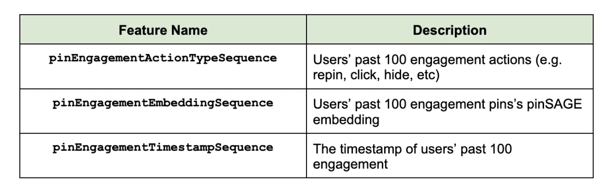
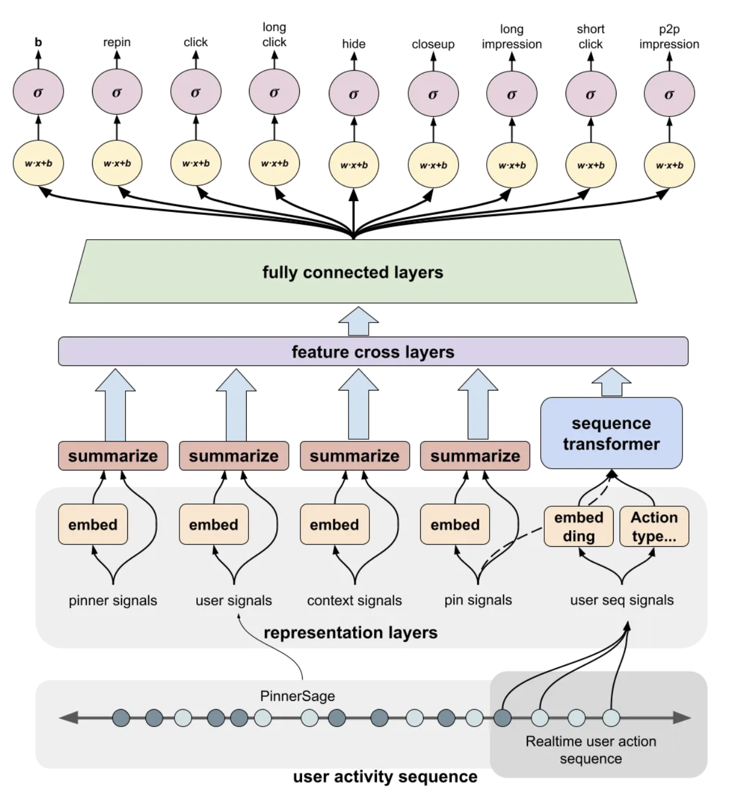
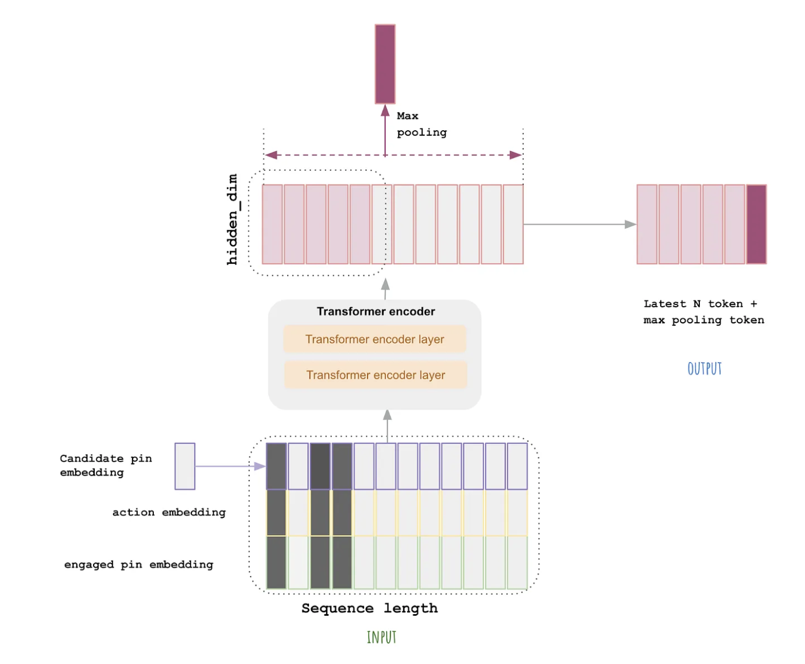
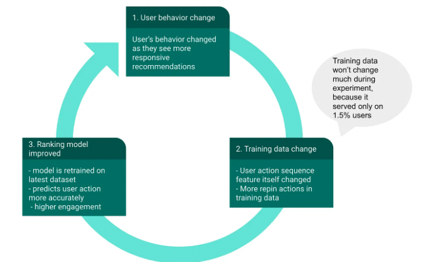

- [How Pinterest Leverages Realtime User Actions in Recommendation to Boost Homefeed Engagement Volume, 2022](https://medium.com/pinterest-engineering/)

## Background
- Pinterest의 homefeed는 pinner에게 아주 중요한 페이지입니다.
- 해당 페이지에서 아이디어를 얻고 이런 경험으로 user engagement가 시작되는 곳입니다.
- 따라서 개인화(추천)이 아주 중요하고 Homefeed ranking model을 통해 다양한 candidate pin들을 추천(랭킹)합니다.
- Homefeed ranking model은 pretrained user embedding을 사용하는데 이때 한계점이 있습니다.
  - pinner의 short term interest를 반영하기 어렵습니다.
  - real time signal을 이용하기 어렵고 static feature들을 사용합니다,
- 이를 위해 최근 pinner들의 action을 이용하여 user experience를 더 좋게 하기 위한 접근을 시작했습니다.

## Method

### Features: Realtime User Action Sequence
- user의 최근 100개 action sequence를 사용합니다.
- homepeed 추천 모델을 위해 아래의 feature들을 만듭니다.

### Modeling: Transformer Encoder
- <user, pin> 마다 다양한 user action을 예측합니다.
- realtime user sequence signals도 input으로 사용합니다.

- 위 그림에서 sequence transformer는 기존 transformer에서 encoder만을 사용해서 user sequence signal을 처리합니다.
- transformer input에서 아래 3가지의 주요 feature를 만듭니다.
  - Engaged pin embedding: user 최근 100개 action에 대한 pin embeddings (learned GraphSage embedding)
  - Action type: user action sequence에서 engagement의 종류 (e.g., repin, click, hide)
  - Timestamp: timestamp of a user’s engagement
- 여기에 추가로 candidate pin embedding도 사용합니다.
- random time window mask도 사용하는데 이는 모델이 덜 민감하고 다양성 감소를 방지하는 역할을 합니다.
  - 아래 그림에 검은색처럼 random하게 masking을 하는 방법
- 아래 그림처럼 encoder의 output에서 가장 최근 token 10개와 max pooling을 concat합니다.
  - (아래 그림이 약간 잘못만든 듯) 최근 token 10로 user의 최근 engegement를 고려
  - max pooling token으로 전체적인 유저의 engagement를 고려
- 이렇게 encoder output의 전체를 사용하지 않아서 explicit feature crossing layer with DCN_v2에서 사용하기 수월해집니다.

### Challenge 1: Engagement Rate Decay
- realtime user action feature를 사용해서인지 retrain을 하는게 효과가 좋았습니다. (ixed보다)
  - online 실험으로 repin volume으로 비교
- 그래서 2주에 한번 모델을 retrain했고 engagement rate는 더 안정적이게 됐습니다.

### Challenge 2: Serving Large Model at Organic Scale
- 원래는 cpu 클러스터에서 서빙을 했는데 transformer를 사용한 이후 gpu를 사용하기 시작했습니다.

## Result
- offline, online evaluation 모두 지금 방법론이 효과적으로 나왔습니다.
- 이런 접근이 loop로 서비스에 도움이 된다는 것을 아래 그림으로 설명합니다.

