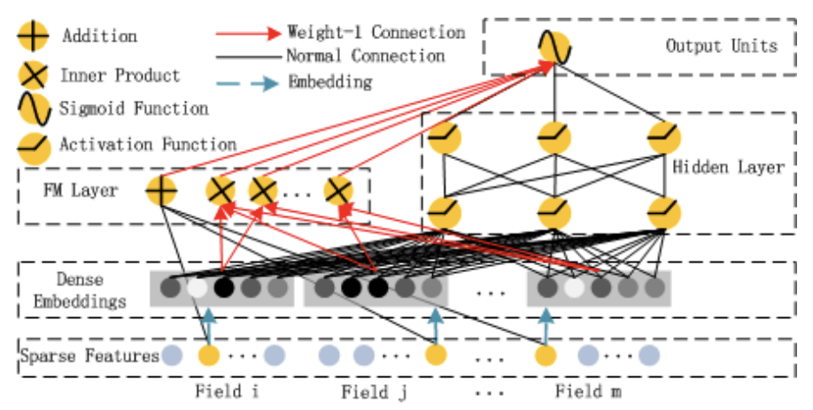
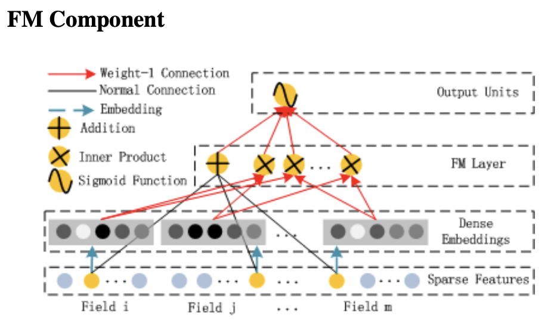
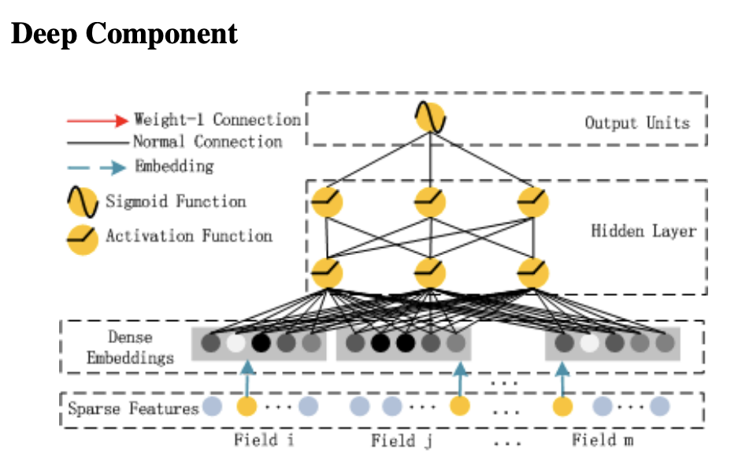

# DeepFM 
- DeepFM: A Factorization-Machine based Neural Network for CTR Prediction, 2017

## 배경
- 추천시스템에서 CTR prediction을 위해 만들었습니다.
- 저자들은 key challenge를 feature interaction이라고 생각했습니다.

## 알고리즘
### 데이터
먼저 DeepFM에서 사용하는 데이터에 대해 알아보겠습니다.
- 논문에서는 feature를 field라고 표현합니다.
  - 따라서 각 instance들은 $x=[x_{field_1},x_{field_2},...,x_{field_m}]$ 의 feature를 가집니다. 각 field는 각기 다른 dimension을 가집니다.
  - 예를 들어, gender field는 2-dim의 feature를 의미하는 것입니다.
- field는 categorical field, continuous field 가 있습니다.
  - categorical field는 one-hot encoding
  - continuous field는 그대로 사용하거나 discretization후 one-hot encoding
- 데이터들은 상당히 sparse하고 target은 CTR이기 때문에 0,1의 값을 가집니다.

### DeepFM
- DeepFM을 크게 두가지 부분으로 나울 수 있습니다. 먼저, 전체 모델의 모습은 아래와 같습니다.
- Deep부분과 FM 부분을 더해서 prediction을 합니다.

$$\hat{y} = sigmoid(y_{FM} + y_{DNN})$$

### FM Component

- FM부분은 이전에 공부했던 Factorization Machine을 의미합니다. 그림이 헷갈릴수 있으나 계산과정도 동일합니다.
- 다만 embedding layer를 이용할 뿐입니다.

### Deep Component

- Deep부분은 feed-forward neural network를 이용하여 high-order feature interaction을 잡는 역할을 합니다.
- 그리고 특이한 점은 여기서 embedding layer는 FM부분의 embedding layer와 동일합니다. 즉, 같은 embedding layer를 사용합니다.
  - 저자들은 2가지 장점을 이야기합니다.
  - low, high order feature interaction을 학습할 수 있다.
  - feature engineering을 할 필요없다. (Wide&Deep, 2016 논문에서는 해야했다)
- 연산의 과정은 다음과 같습니다.
  - m개의 field마다 embedding vector가 뽑히면 (embedding layer를 통과하면) $a^{l}=[\vec{e}_1,\vec{e}_2,...,\vec{e}_m]$가 output이 되고 이를 feed-forward neural network로 보내고 다음과 같은 수식으로 표현할 수 있습니다. $a^{l+1} = \sigma(W^{(l)} a^{(l)} + b^{(l)})$
    

## 실험
- activation function은 relu가 좋았다고 합니다.
- dropout도 0.6-0.9가 좋았다고 합니다.
- network의 모양은 constant한 형태가 좋았다고 합니다.

## 생각정리
- skip

## industry
- industry에서 DeepFM을 사용한 예시로 [무신사가 카테고리숍 추천을 하는 방법](https://medium.com/musinsa-tech/%EB%AC%B4%EC%8B%A0%EC%82%AC%EA%B0%80-%EC%B9%B4%ED%85%8C%EA%B3%A0%EB%A6%AC%EC%88%8D-%EC%B6%94%EC%B2%9C%EC%9D%84-%ED%95%98%EB%8A%94-%EB%B0%A9%EB%B2%95-a45b219685ea)가 있습니다.
  - 개인화하기에는 어려워서 먼저 그룹화한 뒤 그룹마다 추천개인화 적용
  - 그룹화를 위한 feature를 찾는 과정이 있었고 세가지로 최종 성능평가 진행 -> "DeepFM + 성연령 + 브랜드 세그먼트" 최종 선택
    - 성연령 세그먼트
    - 무신사 회원 등급 세그먼트
      - 등급이 높을수록 신상품 클릭, 카테고리숍보다 브랜드숍 기획전 클릭, 많이 노출되는보다 취향에 맞는 상품 클릭
    - 최근에 클릭한 상품과 브랜드로 유저 클러스터링 (TF-IDF, LDA, K-means) -> 브랜드 세그먼트
      - 자주 노출되는 인기 브랜드 선호 그룹, 댄디하고 가격대가 있는 브랜드 선호 그룹, 여성 브랜드 선호 그룹
  - Airflow를 사용했다고 하는 걸로 보아 실시간은 아니고 배치로 진행한듯