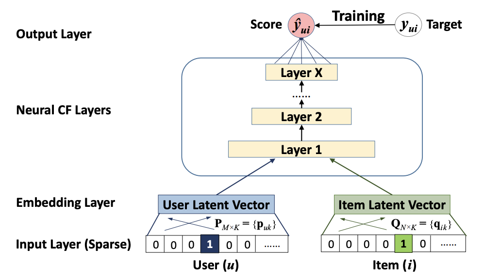
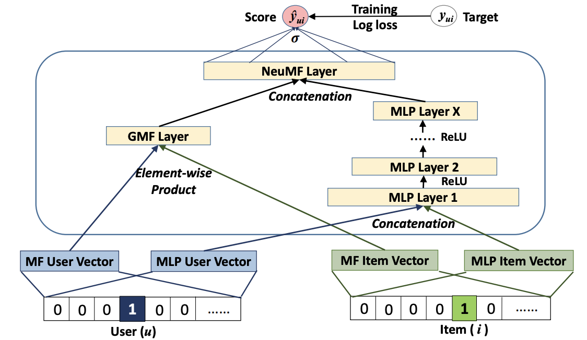

# NCF
- Neural Collaborative Filtering, 2017

## 배경
### Learning from Implicit data
- user-item interaction matrix: 0,1로 user-item이 interaction이 있는지 여부를 표시합니다.
- interaction function을 정의해서 user-item간의 interaction이 있는지 확률을 예측하는 문제를 주로 풀게 됩니다.
- 이 때, 2가지 objective function이 가장 많이 사용합니다.
  - Point-wise: 실제값과 예측값 차이를 최소화합니다.
  - Pair-wise: BPR에서 사용한 것처럼 1이 0보다 더 높은 순위를 갖도록 합니다.

### Matrix Fatorization
- 논문은 기존 MF의 한계점을 언급합니다.
- MF estimates an interaction $y_{ui}$ as inner product

$$\hat{y}_{ui} = f(u,i|p_u, q_i) = p_u^T q_i = \sum_{k=1}^K p _ {uk} q _ {ik}$$

- MF는 user, iterm을 동일한 latent space에 mapping합니다.
  - 두 vector를 inner product하면 1이 나오도록 (크도록) 하기 때문입니다.
- user-item의 관계를 low-dimemsion으로 표현하면서 부정확한 유사관계를 만들 수 있습니다.
- 이를 해결하기 위해 latent vector의 dimension을 키우면 되지만 그렇다고 너무 키우면 overfitting이 발생합니다.
- 그렇다면 non-linear한 DNN을 통해서 복잡한 관계(latent space)를 더 잘 표현해보려고 하는게 NCF입니다.

## 알고리즘

- NCF는 위 사진에서 알 수 있듯이 user, item과 관련한 input을 one-hot encoding한 뒤에 embedding vector를 이용합니다.
- 그리고 그 뒤에 MLP를 통해서 최종적으로 target을 학습합니다. (논문에서는 point-wise loss function을 기준으로 설명)

### GMF
- MF의 원리가 user latent vector와 item latent vector의 inner-product가 실제 interaction 값이 되도록하는 것입니다.
- 논문에서는 이를 일반화할 수 있다고 하며 user, item embedding vector를 inner-product한 뒤에 weight를 곱하고 activation function을 거치는 방법을 소개합니다.

$$y _ {ui} = a(\vec{h}^T (\vec{p}_u \odot \vec{q}_i))$$

### MLP

### NeuMF

- 논문에서는 최종적으로 위의 그림에 해당하는 모델을 사용했으면 NeuMF라고 명명했습니다.
- 위에서 GMF와 MLP부분을 같이 사용합니다.
  - 이 때, embedding vector를 공유할 수도 있고 따로 할 수도 있습니다.
  - 위 그림과 아래 수식은 서로 다른 embeding vector를 사용했다고 가정한 결과입니다.

$$\vec{\psi}^{GMF} = \vec{p}_u^G \odot \vec{q}_i^G$$

$$\vec{\psi}^{MLP} = a_L (W_L^T(a_{L-1}(...a_2(W_2^T\begin{bmatrix} \vec{p}_u^M\\ \vec{q}_i^M\\ \end{bmatrix}+b_2)...) + b_{L-1}) + b_L)$$

$$\hat{y}_{ui} = \sigma(h^t \begin{bmatrix} \vec{\psi}^{GMF}\\ \vec{\psi}^{MLP} \\ \end{bmatrix})$$

## 실험
- skip
