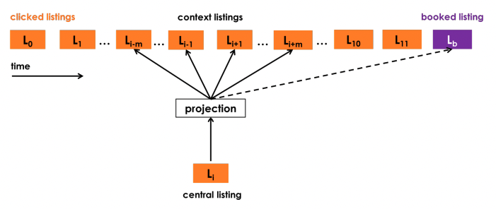
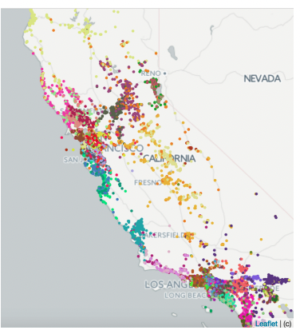
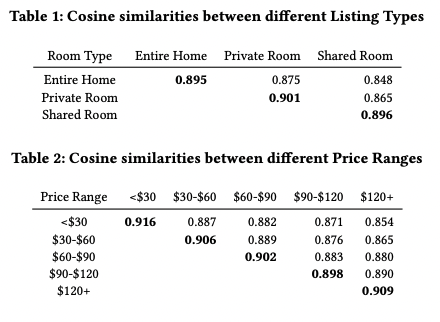
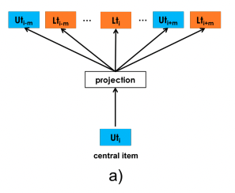
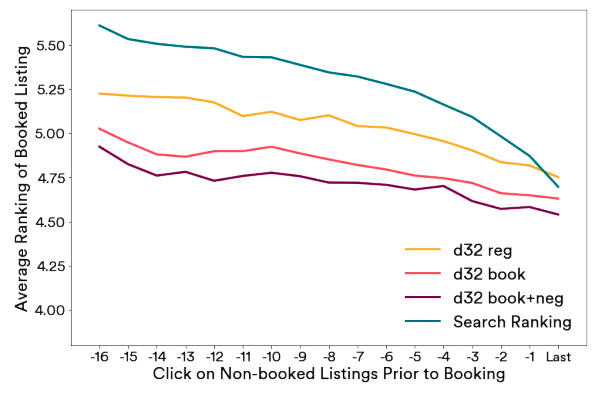
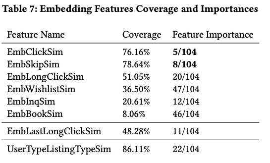

# Paper
- Real-time Personalization using Embeddings for Search Ranking at Airbnb, KDD 2018

## 배경
- Airbnb에서 search ranking을 한 내용을 설명하는 논문입니다.
- search session에서 user가 검색하면 나오는 listing을 최대한 user들이 좋아하는 것들이 노출되도록 하는 것이 목표입니다.
  - session은 user click이 30분동안 없으면 다른 session
- 여행 도메인에서는 각 user들이 여행을 자주 하지 않기 때문에 user id별 보다 user type별 embedding을 만드는 것을 제안한다고 합니다.
- 여행 도메인에서는 search의 범위가 지리적으로 한정적인 경우가 많고 이를 훈련시 고려했다고 합니다.
- click은 결국 conversion으로 이어져야 하기 때문에 listing embedding을 훈련시 고려했다고 합니다.
- 훈련시 host rejection은 explicit negative로 처리했다고 합니다.
- user type embedding과 listing type embedding을 동일한 vector space에서 만들어서 similarity로 rank를 정한다고 합니다.

## 방법론

## Listing Embeddings
- skip-gram 방법론을 이용하여 embedding을 만들었습니다.
  - $S$: a set of S click sessions obtained from $N$ users
  - 각 session $s=(l_1, ..., l_M) \in S$ 은 유저가 click한 $M$개의 listing ids을 의미
  - skip-gram으로 각 listing마다 d차원의 $\vec{v}_{l_i}$를 구하고 비슷한 listing끼리 embedding space에서 가까게 만드는 것이 목표

$$L = \sum _ {s\in S} \sum _ {l_i \in s}(\sum _ {-m \ge j \le m, i \neq 0}) \log P(l _ {i+j} | l_i)$$

$$P(l _ {i+j} | l_i) = \frac{\exp (\vec{v}^T _ {l_i} \vec{v} _ {l _ {i+j}} )}{\sum_{l=1}^V \exp (\vec{v}^T _ {l_i} \vec{v}_l )}$$

- session마다 click한 순서대로 데이터를 만들고 word2vec의 skip-gram으로 embedding을 만드는 것입니다.
- negative sampling는 전체 vocab $V$에서 random하게 뽑아서 사용했다고 합니다.

### Booked Listing as Global Context
- click session은 listing을 예약했는지 여부에 따라 2가지로 나눌 수 있습니다.
  - booked sessions, exploratory sessions
- booked sessions은 context window에 booked listing이 없어도 항상 학습에 사용합니다.
  - 그래서 global context를 학습한다고 말하고 있습니다.

- optimization objective는 아래와 같습니다.

$$argmax_{\theta} \sum_{(l,c) \in D_p} \log \frac{1}{1+e^{- \vec{v}^T_c \vec{v}_l}} + \sum_{(l,c) \in D_n} \log \frac{1}{1+e^{ \vec{v}^T_c \vec{v}_l}} + \log \frac{1}{1+e^{- \vec{v}^T _ {l_b} \vec{v}_l}}$$

###  Adapting Training for Congregated Search
- negetive sampling을 random으로 하면 central listing과 거리가 먼 listing이 뽑힐 확률이 높습니다.
- 따라서 이런 현상을 완화시키기 위해 각 optimization step마다 같은 지역의 negative sample을 추가해서 학습한다고 합니다.

### Cold start listing embeddings
- 새롭게 들어온 listing은 click session data가 없습니다.
- 이들의 embedding을 만들기 위해 host가 작성한 meta data를 활용합니다.
- meta data를 기준으로 embedding list 3개를 뽑아 mean vector를 만들어서 cold start 문제를 해결합니다.

### Examining Listing Embeddings
- 32-dim의 embedding을 800 million click session으로 훈련시켰습니다.
- embedding의 결과를 살펴보기 위해 k-means clustering을 진행했습니다.
  - 비슷한 색끼리 잘 지역별로 잘 모여있는 편입니다.

- cosine similarity도 계산했고 예상대로 정보들이 embedding에 잘 녹아들었다고 할 수 있습니다.
  - 비슷한 특징을 갖는 embedding끼리 similarity값이 큽니다.

## User-type & Listing-type Embeddings
- 위에서 살펴본 click session 데이터를 이용한 embedding은 (여행이기에) 한정된 지역(same market)안에서 session이라는 short-term에 특화되어있다고 할 수 있습니다.
- 어떤 유저의 지금 session이 아닌 과거의 데이터를 이용해서 다른 지역을 예약할 때도 사용할 수 있지 않을까 생각이 듭니다.
- 하지만 여기서 어려운 부분들이 있습니다.
  - click session 데이터에 비해 booking session 데이터는 작습니다.
  - 많은 유저들이 딱 한 번 booking한 경험이 있습니다.
  - 유의미한 embedding이 나오려면 listing이 5-10회 있어야 합니다.
  - 특정 유저의 booking 경험이 시간이 많이 흘렀다면 선호도가 변했을 수 있습니다.
- 이러한 문제를 위해 listing_id가 아닌 listing_type의 embedding을 만드는 것을 제안합니다.
  - 다양한 meta data를 활용하여 rule-based로 type을 만듭니다.
- 또한, 시간 간격에 따라 유저의 선호도가 변하는 것을 고려하기 위해 listing_type embedding과 같은 vector space에 user_type embedding을 만드는 것을 제안합니다.
  - 이 또한 user와 과거 booking이력에 대한 meta data를 활용하여 type을 만듭니다.

### Training Procudure
- 이 둘을 같은 vector space로 만들기 위해 booking session에 user를 집어 넣습니다.
  - 각 user마다 booking session 순서대로 데이터를 만듭니다.
  - 이때, (user_type, listing_type)이 옆에 붙어 있습니다.
  - 각 user의 순서가 지남에 따라 user_type, listing_type을 달라질 수 있습니다.

- 여기서는 이전처럼 negative sampling을 할 때, 같은 지역의 데이터를 따로 추가로 뽑을 필요가 없습니다.

### Explicit Negatives for Rejections
- click과 다르게 booking에서는 host가 rejection이 가능하고 이를 embedding을 만들때 고려합니다.

## 실험
### Training Listing Embeddings
- 8억개의 click session으로 32-dim의 listing embedding을 만들었습니다.
- 일배치로 훈련합니다.
- 매일 embedding parameter들은 random하게 시작합니다. 

### Offline Evaluation of Listing Embeddings
- 가장 최근 clicked listing과 rank을 구해야하는 candidate가 주어졌다고 하면 이 둘의 cosine similarity를 구합니다.
- 그 후, booking이 일어나기 전 click listing의 average ranking을 구합니다.

### Similar Listings using Embeddings
- 비슷한 listing을 보여주는 곳에서도 embedding을 사용하였고 AB Test에서 좋은 결과를 보였습니다.

### Real time personalization in Search Ranking using Embeddings
- search ranking model은 pairwise regression GBDT 모델을 사용하였습니다.
  - feature: listing features, user features, query features, cross-features 등 100여개
  - label: 0, 0.01, 0.25, 1, -0.4 (not clicked, clicked, contacted, booked, guest rejected)
  - 예측 확률이 큰 순서대로 user에게 노출됩니다.

- embedding features를 similarity를 계산하여 search ranking model에 추가합니다.
  - listing은 6가지 종류로 구분합니다. 대표적으로 '지난 2주동안 클릭한 listing'이 있습니다.
  - 이들과 candidate listing과의 similarity를 구하여 score값을 feature로 사용합니다.
    - 예를 들어, candidate A와 '지난 2주동안 클릭한 listing'들의 max cosine similarity값을 구해서 EmbClickSim feature 값을 만듭니다.

- user-type & listing-type embedding feature도 비슷합니다.
  - 현재 user-type과 candidate listing-type의 cosine similarity를 feature로 사용합니다.

- UserTypeListingTypeSim이 feature importance가 가장 높게 나왔습니다.
  - 많은 양의 데이터과 과거 long-term의 정보를 담고 있어서라고 예상됩니다.

 

### Online Experiment Results Summary
- AB test를 진행했고 결과가 좋게 나왔다고 합니다.
- DCU((Discounted Cumulative Utility)를 metric으로 사용했습니다.