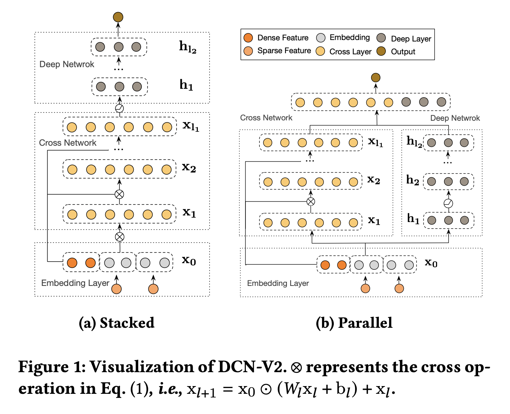
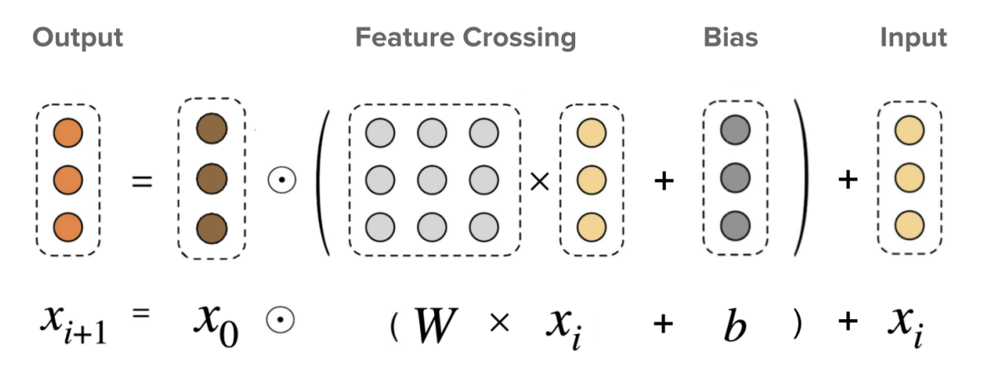

# Paper
- DCN V2: Improved Deep & Cross Network and Practical Lessons for Web-scale Learning to Rank Systems 2020, google

## 배경
- 이 논문은 기존의 DCN 알고리즘을 더 개선시킨 모델입니다.
- 최근에 DNN은 2nd, 3rd-order feature cross에 대한 효과적이지 않다는 연구가 있습니다.
  - 이를 개선하기 위해서 model capaity를 키워서 보완할 수 있습니다.
  - 하지만 trainability와 serving system을 고려하면 model를 키우는데에 한계가 있습니다.
- 일반적으로 implicit high-order cross는 DNN, explicit and bouned-degree feature는 linear model을 이용합니다.

## 방법론
- 모델의 구조는 아래와 같습니다.
- 2가지 구조가 있는데 data마다 성능이 달라집니다.
- DCN-V2는 prediction-task와 loss-function agnostic합니다.

### Embedding Layer
- embedding layer 부분에는 categorical, dense feature를 함께 사용합니다.
  - categorical feature는 embedding vector로 만들어서 사용합니다.
  - 이 떄, embedding vector의 크기는 feature마다 자유롭게 설정합니다.

### Cross Network
- $x_0$는 embedding layer입니다. (처음 input)
- 따라서 $l$-layered cross network에서 the highest polynomial order는 $l+1$이고 cross network에는 말 그대로 feature cross 연산을 담당하는 것입니다.

### Deep Network
- 이 부분은 그림처럼 feed-forward와 activation function으로 이루어진 network입니다.

### Cost-Effective Mixture of Low-Rank DCN
- serving에 사용하는 모델은 resource와 latency를 고려해야해서 low-rank 기술을 많이 사용합니다.
- weight에 대해 행렬분해 기법입니다. $M \in R^{d*d}$의 행렬이 있을 때 이를 더 작은 $U,V in R^{d*r}, r \le d/2$로 표현할 수 있다면 이를 이용합니다.
  - 이들은 singular value들간의 차이가 클수록 (또는 decay가 빠를수록) 효과적입니다.
- 이 부분에 대해서는 해당 논문 이외의 지식도 많이 필요하기에 좀 더 구체적인 방법 설명 부분은 생략합니다.

## 실험
- (RQ1) 언제 feature interaction learning 방법이 (ReLU-based) DNN보다 더 효과적인가?
  - synthetic dataset(function)을 만들어서 다양한 order feature cross에 대해 DCN, DCN-V2, DNN 각 모델들의 성능을 실험했습니다.
  - DNN이 가장 낮은 성능이었습니다.
  - DCN-V2에서 bias, residual도 좋은 역할을 해줍니다.
  - 특히 order가 높아질수록 DNN은 (explicit) feature cross에 대해 더 어려워했고 layer가 깊어진다고 해서 성능이 별로 오르지 않았습니다.
- (RQ2) DNN 없이 feature interaction 부분이 얼마나 효과적인가?
  - criteo dataset으로 sparse category feature들만 이용하여 PNN, FM, DNN 등 다양한 알고리즘으로 성능 실험을 했습니다.
  - 각 모델들은 DNN부분은 제외하고 feature interaction부분만 성능 실험의 대상입니다.
  - 전반적으로 2nd-order보다 higher order 방법들이 성능이 좋았습니다.
- (RQ3) skip 
- (RQ4) skip
- (RQ5) skip

## 생각정리
- 논문에서 다룬 내용중 수학적이거나 추가적인 지식이 필요한 부분은 생략해서 정리했습니다. 역시 갓글이라 그런지 미국박사분들이 접근할만한 어렵고 좋은 아이디어들이 돋보입니다.
  - 실제 서빙해서 사용할 떄, 단순히 위 방법론의 알고리즘을 사용한 것이 아니라 다양한 최적화 기법을 사용했음을 알 수 있습니다.
  - 지금 현업에서도 추천관련 업무를 하고 있지만 구글만큼 전 세계적인 서비스하는 것이 아니라 이런 부분은 논문에서만 접해볼 수 있을 것 같습니다.
- 가장 재밌었던 부분은 serving resource 최적화 접근과 high order에 대해 실험적으로 탐구한 부분이었습니다. 
  - 이 논문을 읽기 전에는 cross접근에서 implicit, explicit으로 나누어서 생각해보지 못했습니다.